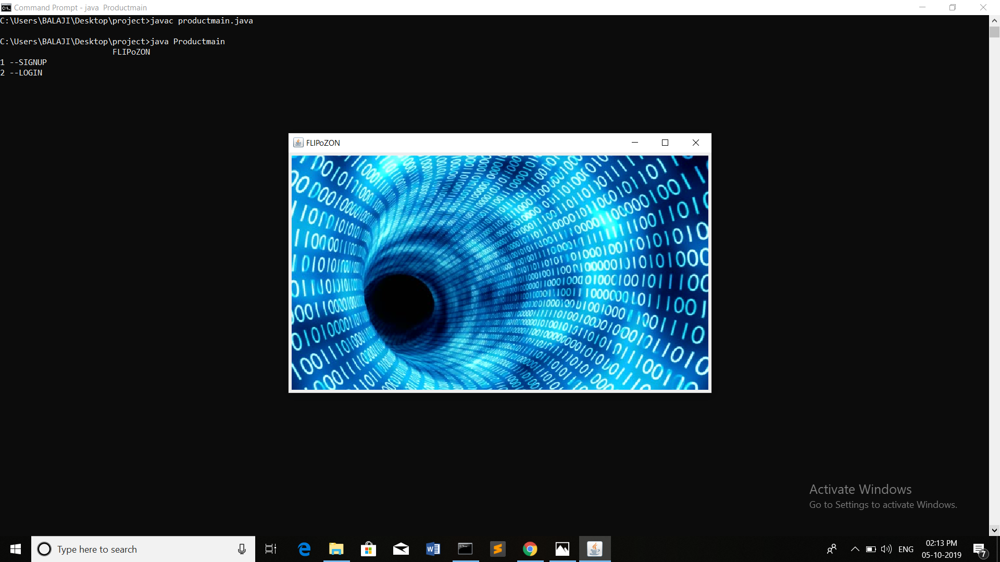
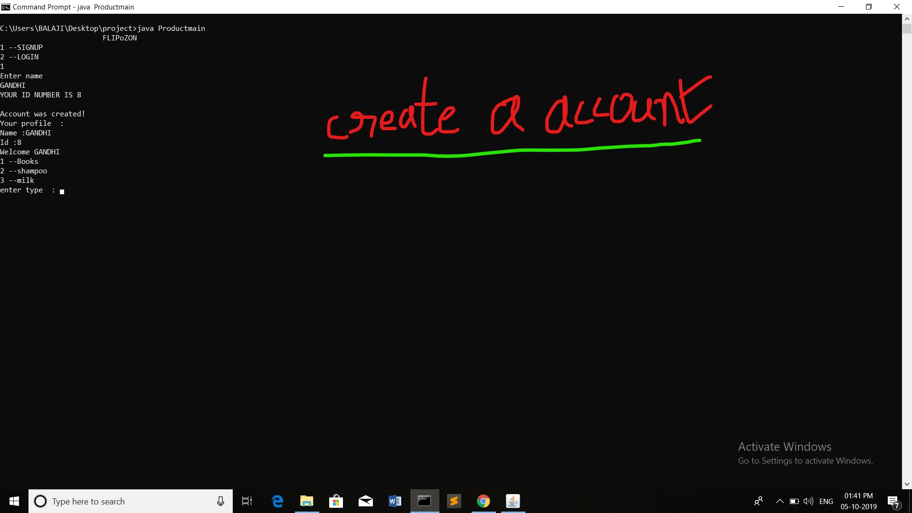
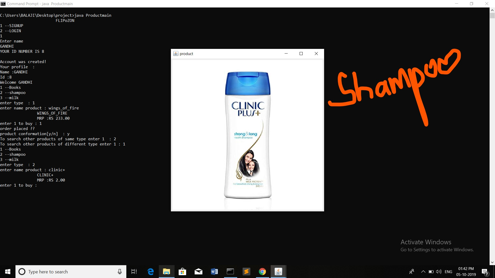
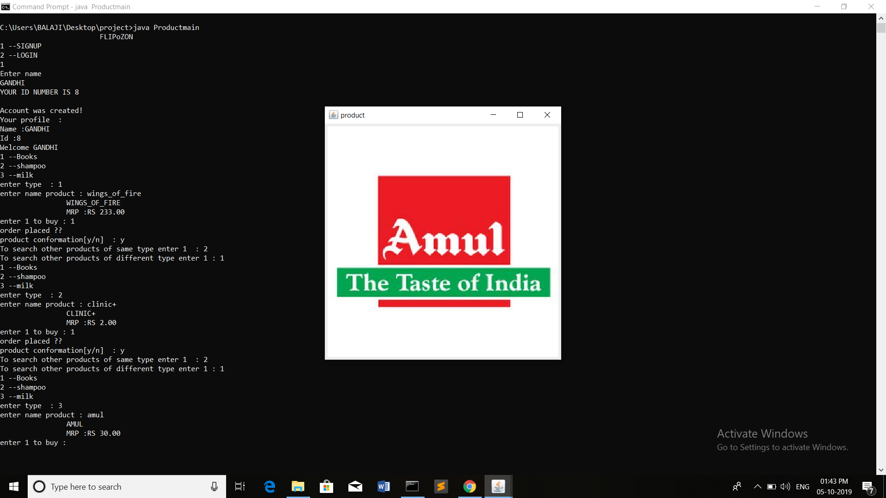
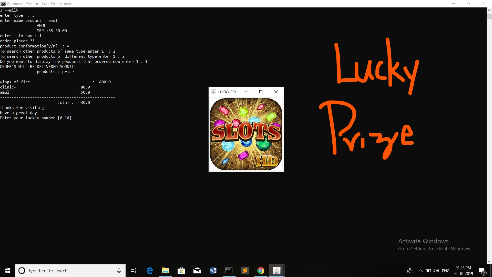
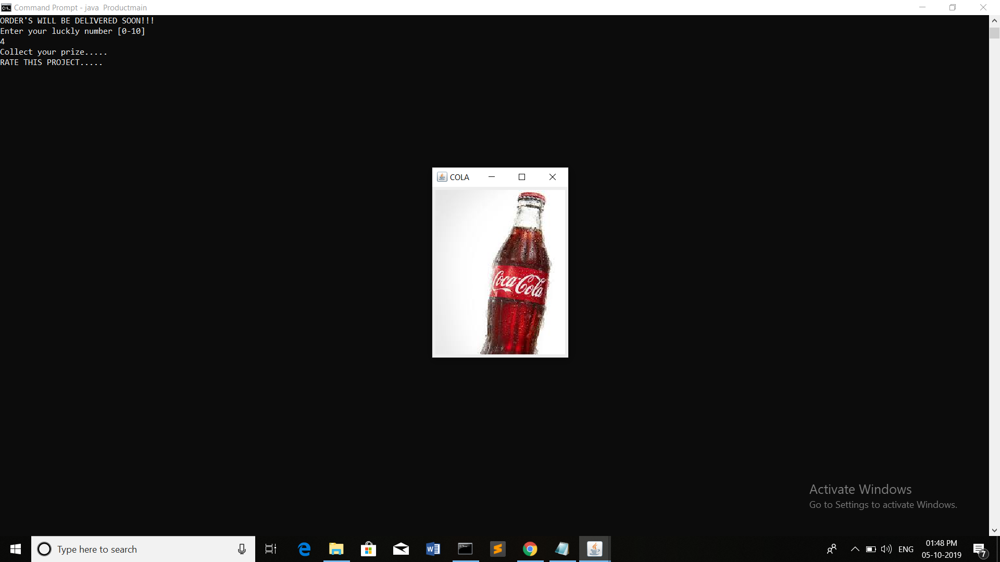
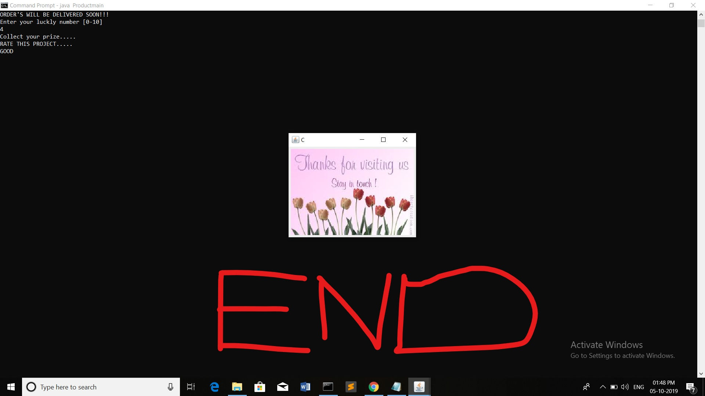
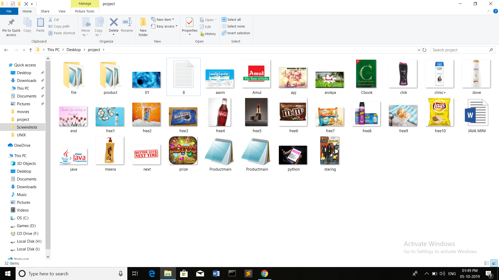

# Flipozan-Shopping-Application

									    FLIPoZON
                      							  _ _
                       							    /
                      							  _/_

LANGUAGE :  ENGLISH

                  						INSTRUCTION MANUAL

DO

	After opening you will find a java file named (productmain.java) ,when you run that java file, program starts working with name FLIPoZON
                              						      <+==+>

	 				    =+>   you have to choose given options [ login ] or [ signup ]   	<+=
	
					    =+>   try to give correct user name while login   <+=
	
	 				    =+>   if you have not account in yet ,just type your name for create a new account  <+=

                      						               <+==+>
					.... while searching for an product try to give it’s full name
	   				     and for user benefit we made product conformation two         
	 				     times to avoid mistakes ....
	
					!!!!	 after finishing your purchase ,we will generate a bill with all informations 	!!!!

					!!!!	 before leaving ,please take your prize by giving your lucky number 		!!!!

DON'T

	!! NOTHING !!	

IMPORTANT NOTE

	-> please give a good feedback.
	-> Required java version :java version-13

Customer Care Centre

    CSE A	

CODING SECTION

    M.ASWIN
    S.BALAJI

TESTING DONE BY

	MRS.RAJA LAKSHMI mam		
  
IO

THANK YOU
																															
